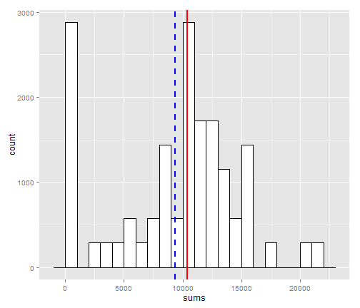
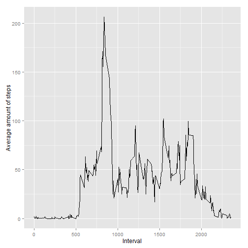
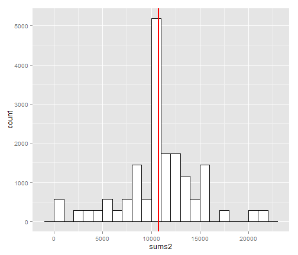
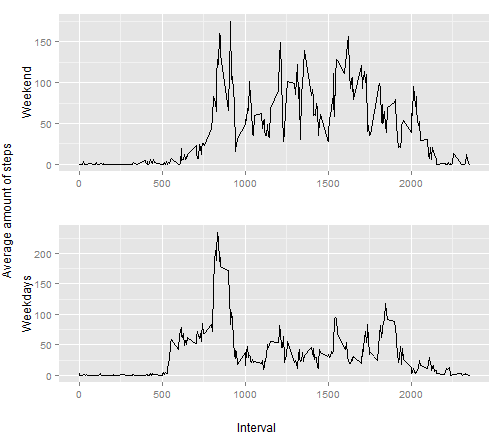

# Reproducible Research: Peer Assessment 1


## Loading and preprocessing the data

```r
act <- read.csv(file = "activity.csv",
                header = T,
                col.names = c("Steps", "Date", "Interval"),
                colClasses = c("numeric", "Date", "numeric"))
```

## What is mean total number of steps taken per day?

Histogram of the total number of steps taken each day with indicated mean value blue and median value red


```r
ggplot(act, aes(x=sums)) +
    geom_histogram(binwidth=1000, colour="black", fill="white") + 
    geom_vline(aes(xintercept=mean(sums, na.rm=T)),
               color="blue", linetype="dashed", size=1) +
    geom_vline(aes(xintercept=median(sums, na.rm=T)),
               color="red", linetype="solid", size=1)
```

 

**MEAN** and **MEDIAN** total number of steps taken per day

Mean = 9354.2295;
Median = 1.0395 &times; 10<sup>4</sup>

## What is the average daily activity pattern?


```r
ggplot(act, aes(x=act[act$Date=="2012-10-01", 3], y=sumint)) +
    labs(x = "Interval", y = "Average amount of steps") +
    geom_line()
```

 


5-minute interval, taken from average across all the days in the dataset, containing the maximum number of steps is 835.


Total number of missing values in the dataset = 2304.

## Imputing missing values


Histogram of the total number of steps taken each day with NA values changed


```r
ggplot(act2, aes(x=sums2)) +
    geom_histogram(binwidth=1000, colour="black", fill="white") + 
    geom_vline(aes(xintercept=mean(sums2, na.rm=T)),
               color="blue", linetype="dashed", size=1) +
    geom_vline(aes(xintercept=median(sums2, na.rm=T)),
               color="red", linetype="solid", size=1)
```

 

**MEAN** and **MEDIAN** total number of steps taken per day

Mean without NA = 1.0766 &times; 10<sup>4</sup>;
Median without NA = 1.0766 &times; 10<sup>4</sup>

*Do these values differ from the estimates from the first part of the assignment?*
Yes, the values are different. There is significant change in histogram at around 0 and 10000 steps. Both Mean and median has changed.

*What is the impact of imputing missing data on the estimates of the total daily number of steps?*
Mean and median values has changed. 

## Are there differences in activity patterns between weekdays and weekends?


```r
p1 <- ggplot(act, aes(x=act[act$Date=="2012-10-01", 3], y=avewkend)) +
    labs(x = "", y="Weekend") +
    geom_line()
p2 <- ggplot(act, aes(x=act[act$Date=="2012-10-01", 3], y=avewkday)) +
    labs(x = "", y="Weekdays") +
    geom_line()
grid.arrange(p1, p2, nrow = 2, left= "Average amount of steps", sub="Interval")
```

 
